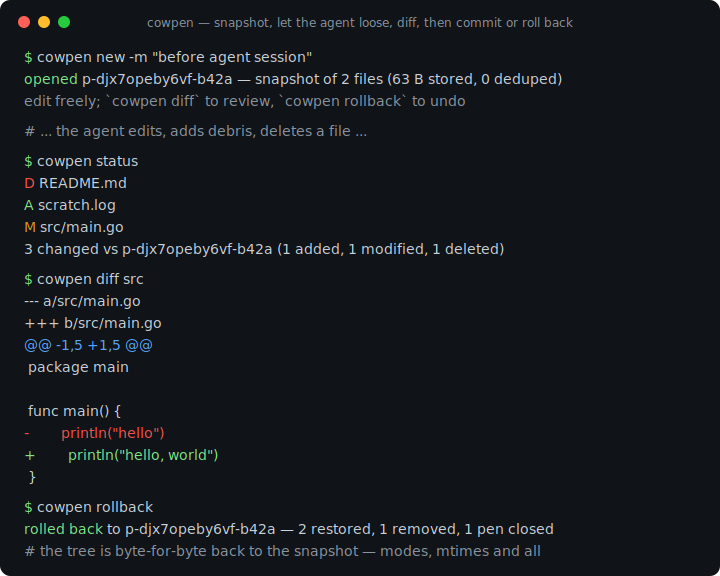
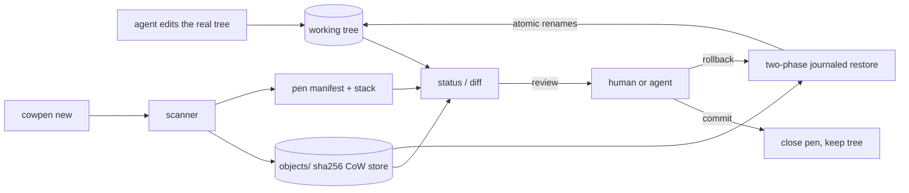

# cowpen

[English](README.md) | [中文](README.zh.md) | [日本語](README.ja.md)

[](LICENSE) [](go.mod) [](CHANGELOG.md)  [](CONTRIBUTING.md)

**cowpen：エージェント編集のための使い捨てコピーオンライト・ワークスペース——1 コマンドでツリーをスナップショットし、エージェントに自由にやらせ、あとで diff・commit・原子的ロールバック。**



```bash
git clone https://github.com/JaydenCJ/cowpen && cd cowpen
go build -o cowpen ./cmd/cowpen    # single static binary, stdlib only
```

> プレリリース：v0.1.0 はまだどのパッケージレジストリにも公開されていません。上記の手順でソースからビルドしてください（Go ≥1.22 なら可）。

## なぜ cowpen？

コーディングエージェントは作業ツリーを壊します。マイグレーションを中途半端に終え、ゴミファイルを撒き散らし、間違ったものを消す——そして既存の安全網はどれも cowpen が要らない前提に立っています。Git はツリーが*リポジトリであり* stash できるほどクリーンだと仮定します：`git stash`/`worktree` は未追跡のゴミを一貫して守れず、WIP コミットで本当の履歴を汚し、リポジトリ外では何もできません。コンテナや overlayfs は本物の CoW を提供しますが、root 権限、Linux 固有のマウント、そしてエージェントのツールチェーン一式の移設を要求します。ファイルシステムスナップショット（btrfs、ZFS、APFS）は素晴らしい——数年前に FS を選んだ時点でこの日を見越していたなら。cowpen はユーザー空間での答えです：`cowpen new` が任意のディレクトリをコンテンツアドレス型ストアへスナップショットし（同一内容は 1 回だけ保存——これがコピーオンライト）、エージェントは普段のツールで*本物の*ツリーをその場で編集し、あとにはレビュー可能な unified diff と、ジャーナル付きで原子的な 1 コマンドロールバックが残ります——ファイル、パーミッション、mtime、シンボリックリンク、削除されたディレクトリツリーまで正確に復元。これは明確にシステムコール・サンドボックスでは*ありません*：cowpen は書き込みを防ぐのではなく、破壊を安く検査・取り消しできるようにします。

| | cowpen | git stash / worktree | コンテナ / overlayfs | FS スナップショット (btrfs/ZFS) |
|---|---|---|---|---|
| 任意のディレクトリで動作、リポジトリ不要 | ✅ | ❌ リポジトリのみ | ✅ | ❌ その FS のみ |
| root・マウント・デーモン不要 | ✅ | ✅ | ❌ | 部分的 |
| エージェントは普段のツールで本物のツリーを操作 | ✅ | ✅ | ❌ 箱の中だけ | ✅ |
| ファイル単位でレビュー可能な unified diff | ✅ | 部分的、追跡ファイルのみ | ❌ レイヤーは不透明 | ❌ |
| 未追跡ゴミも含む 1 コマンド原子ロールバック | ✅ ジャーナル付き | ❌ 未追跡が残る | ✅ レイヤー破棄 | ✅ |
| VCS 履歴をクリーンに保つ（WIP コミットなし） | ✅ | ❌ | ✅ | ✅ |
| ランタイム依存 | 0 | git | ランタイム + root | FS + ツール |

<sub>依存数は 2026-07-13 に確認：cowpen は Go 標準ライブラリのみを import。コンテナ型の隔離はコンテナランタイムを必要とし、エージェントのホストでは通常 root か userns の設定が要ります。</sub>

## 特長

- **1 コマンドのチェックポイント** — `cowpen new` はツリーをスナップショットしてすぐ道を空けます。エージェントは普段のツールでその場で編集を続行——ラッパーも chroot も PATH 細工もなし。
- **コピーオンライト・ストレージ** — ファイル本体は SHA-256 コンテンツアドレス型ストアに 1 回だけ保存。変更のないツリーに pen を重ねても新規バイトはゼロ、閉じた pen は `gc` が回収。
- **レビュー可能な diff** — 内蔵の Myers 差分器が git 互換の unified hunk を出力（正しい `@@` ヘッダ、`\ No newline` マーカー付き）。バイナリ、シンボリックリンク、モード変更、型変更は 1 行の通知に。
- **原子的でジャーナル付きのロールバック** — 復元物は宛先の隣にステージし、変更前にジャーナルへ記録し、冪等な rename で適用。復元中のクラッシュは `rollback --resume` が完遂し、中途半端には決してなりません。
- **スタック可能な pen** — 危険なステップの前ごとにチェックポイント。`commit` は最上位の pen を受理しつつ外側の pen は待機を続け、`rollback --to <id>` は任意の深さまで巻き戻せます。
- **速く誠実な変更検出** — git 流の size+mtime+mode 高速パス、不一致時のみハッシュ計算、`--verify` で全量再ハッシュ。バイト同一の書き直しは決して変更として報告されません。
- **依存ゼロ・完全オフライン** — Go 標準ライブラリのみ。テレメトリなし、ネットワーク呼び出しなし、ワークスペースのルートから何も出ていきません。

## クイックスタート

```bash
cowpen new -m "before agent session"   # snapshot, then let the agent work
```

実際にキャプチャした出力：

```text
opened p-djx7opeby6vf-b42a — snapshot of 2 files (63 B stored, 0 deduped)
edit freely; `cowpen diff` to review, `cowpen rollback` to undo
```

エージェントがファイルを 1 つ変更し、ゴミを残し、README を削除した後（`cowpen status`、実出力——終了コード 1 は「変更あり」の意味）：

```text
D README.md
A scratch.log
M src/main.go
3 changed vs p-djx7opeby6vf-b42a (1 added, 1 modified, 1 deleted)
```

ソースディレクトリだけをレビューし、すべてを取り消す（`cowpen diff src` + `cowpen rollback`、実出力）：

```text
--- a/src/main.go
+++ b/src/main.go
@@ -1,5 +1,5 @@
 package main
 
 func main() {
-	println("hello")
+	println("hello, world")
 }

rolled back to p-djx7opeby6vf-b42a — 2 restored, 1 removed, 1 pen closed
```

コマンド全体を非対話で守るには同梱のラッパーを：`bash examples/agent-guard.sh --auto <command>` は終了コード 0 なら変更を保持し、失敗ならロールバック。`examples/checkpoint-loop.sh` はステップごとのスタック型チェックポイントを示します。

## コマンドと終了コード

`cowpen [--root DIR] [--format json] <command>` — ワークスペースのルートは、カレントディレクトリから上方向で最も近い `.cowpen` ディレクトリがデフォルトです。

| コマンド | 効果 |
|---|---|
| `new [-m NOTE]` | pen を開く：ツリーを `.cowpen/` にスナップショットし、自由に編集 |
| `status [--verify]` | 最上位 pen 以降の変更を列挙。`--verify` は全量再ハッシュ |
| `diff [PATH...]` | 変更の unified diff。パスで範囲を絞れます |
| `commit [-m NOTE]` | 変更を受理して最上位 pen を閉じる（外側の pen は待機継続） |
| `rollback [--to ID]` | スナップショットを原子的に復元。`--resume` は中断分を完遂 |
| `list` / `show ID` / `log` | 開いている pen · 個別 pen の詳細 · 追記専用の監査履歴 |
| `gc` | どの開いた pen からも参照されないブロブを削除 |

終了コード：**0** 正常/クリーン · **1** 変更あり（`status`/`diff`） · **2** 使い方エラー · **3** 実行時エラー。`--format json` は `diff` と `version` を除くすべてのコマンドを機械可読出力にし、エージェント統合に使えます。

## 無視ルール

ワークスペースのルートの `.cowpenignore` は gitignore の厳密なサブセットです——`#` コメント、セグメント内の `*`/`?`、セグメント横断の `**`、末尾 `/` はディレクトリ、先頭 `/` はアンカー。否定構文は誤マッチせず大きな声で拒否されます。`.cowpen/` と `.git/` は常に除外。無視されたパスはスナップショット・status・diff *そして*ロールバックからも不可視——cowpen は無視ファイルを決して削除しません。削除中のディレクトリ内にあっても、です。ディスク上のレイアウト詳細は [docs/format.md](docs/format.md) へ。

## 検証

このリポジトリは CI を同梱しません。上記の主張はすべてローカル実行で検証されています：

```bash
go test ./...            # 89 deterministic tests, offline, < 5 s
bash scripts/smoke.sh    # end-to-end CLI check, prints SMOKE OK
```

## アーキテクチャ



## ロードマップ

- [x] v0.1.0 — コンテンツアドレス型 CoW スナップショット、`--verify` 付き git 流変更検出、内蔵 Myers unified diff、`--resume` 付き 2 相ジャーナル原子ロールバック、スタック可能な pen、`.cowpenignore`、JSON 出力、監査ログ、gc、89 テスト + smoke スクリプト
- [ ] `cowpen watch` — 長いエージェントセッション中、ファイル変更のデバウンスで自動チェックポイント
- [ ] 部分ロールバック：`rollback -- <path>` で選択ファイルだけ復元し残りは保持
- [ ] 旧 pen のパック形式：閉じた pen のマニフェストとブロブを単一アーカイブへ圧縮
- [ ] `cowpen export` — pen の変更を `git apply` 可能なパッチとして出力
- [ ] ハッシュ時間が支配的な巨大ツリー向けの、オプションのハードリンクモード

全リストは [open issues](https://github.com/JaydenCJ/cowpen/issues) を参照。

## コントリビュート

Issue・ディスカッション・PR を歓迎します——ローカルのワークフロー（フォーマット、vet、テスト、`SMOKE OK`）は [CONTRIBUTING.md](CONTRIBUTING.md) へ。入門タスクには [good first issue](https://github.com/JaydenCJ/cowpen/issues?q=is%3Aissue+is%3Aopen+label%3A%22good+first+issue%22) ラベルが付いており、設計の議論は [Discussions](https://github.com/JaydenCJ/cowpen/discussions) で行われています。

## ライセンス

[MIT](LICENSE)
