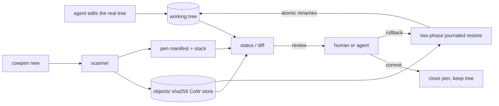

# cowpen

[English](README.md) | [中文](README.zh.md) | [日本語](README.ja.md)

[](LICENSE) [](go.mod) [](CHANGELOG.md)  [](CONTRIBUTING.md)

**cowpen：throwaway copy-on-write workspaces for agent edits — snapshot a tree in one command, let the agent loose, then diff, commit, or roll back atomically.**


```bash
git clone https://github.com/JaydenCJ/cowpen && cd cowpen
go build -o cowpen ./cmd/cowpen    # single static binary, stdlib only
```

> Pre-release: v0.1.0 is not tagged on a package registry yet; build from source as above (any Go ≥1.22).

## Why cowpen?

Coding agents trash working trees. They half-finish migrations, scatter debris files, delete the wrong thing — and the existing safety nets all assume something cowpen doesn't. Git assumes the tree *is* a repo and clean enough to stash: `git stash`/`worktree` won't save untracked debris coherently, pollutes real history with WIP commits, and does nothing outside a repo. Containers and overlayfs give real CoW but demand root, a Linux-specific mount, and moving the agent's whole toolchain inside. Filesystem snapshots (btrfs, ZFS, APFS) are great — if you chose your filesystem years ago with this in mind. cowpen is the userspace answer: `cowpen new` snapshots any directory into a content-addressed store (identical content stored once — that's the copy-on-write), the agent edits the *real* tree in place with its normal tools, and afterwards you get a reviewable unified diff and a one-command, journaled, atomic rollback — files, modes, mtimes, symlinks, and deleted directory trees all come back exactly. It is explicitly *not* syscall sandboxing: cowpen makes damage cheap to inspect and undo rather than trying to prevent writes.

| | cowpen | git stash / worktree | container / overlayfs | fs snapshots (btrfs/ZFS) |
|---|---|---|---|---|
| Works on any directory, no repo required | ✅ | ❌ repo only | ✅ | ❌ that fs only |
| No root, no mounts, no daemon | ✅ | ✅ | ❌ | partial |
| Agent uses its normal tools on the real tree | ✅ | ✅ | ❌ inside the box | ✅ |
| Reviewable per-file unified diff of the damage | ✅ | partial, tracked files | ❌ layer opaque | ❌ |
| One-command atomic rollback incl. untracked debris | ✅ journaled | ❌ leaves untracked | ✅ discard layer | ✅ |
| Keeps VCS history clean (no WIP commits) | ✅ | ❌ | ✅ | ✅ |
| Runtime dependencies | 0 | git | runtime + root | fs + tooling |

<sub>Dependency count checked 2026-07-13: cowpen imports the Go standard library only; container-based isolation needs a container runtime and typically root or a userns setup on the agent host.</sub>

## Features

- **One-command checkpoints** — `cowpen new` snapshots the tree and gets out of the way; the agent keeps editing in place with its normal tools, no wrapper, no chroot, no PATH games.
- **Copy-on-write storage** — file bodies live once in a SHA-256 content-addressed store; stacking a pen over an unchanged tree stores zero new bytes, and `gc` reclaims closed pens.
- **Reviewable diffs** — a built-in Myers differ renders git-compatible unified hunks (correct `@@` headers, `\ No newline` markers); binaries, symlinks, mode flips and type changes get one-line notices.
- **Atomic, journaled rollback** — restores are staged next to their destinations, journaled before any mutation, and applied as idempotent renames; a crash mid-restore is finished by `rollback --resume`, never left half-done.
- **Stacked pens** — checkpoint before every risky step; `commit` accepts the top pen while outer pens stay armed, `rollback --to <id>` unwinds any depth.
- **Fast, honest change detection** — git-style size+mtime+mode fast path, hashing only on disagreement, `--verify` to re-hash everything; byte-identical rewrites are never reported as changes.
- **Zero dependencies, fully offline** — Go standard library only; no telemetry, no network calls, nothing leaves the workspace root.

## Quickstart

```bash
cowpen new -m "before agent session"   # snapshot, then let the agent work
```

Real captured output:

```text
opened p-djx7opeby6vf-b42a — snapshot of 2 files (63 B stored, 0 deduped)
edit freely; `cowpen diff` to review, `cowpen rollback` to undo
```

After the agent modified one file, added debris, and deleted the README (`cowpen status`, real output — exit code 1 means "changes exist"):

```text
D README.md
A scratch.log
M src/main.go
3 changed vs p-djx7opeby6vf-b42a (1 added, 1 modified, 1 deleted)
```

Review just the source directory, then undo everything (`cowpen diff src` + `cowpen rollback`, real output):

```text
--- a/src/main.go
+++ b/src/main.go
@@ -1,5 +1,5 @@
 package main
 
 func main() {
-	println("hello")
+	println("hello, world")
 }

rolled back to p-djx7opeby6vf-b42a — 2 restored, 1 removed, 1 pen closed
```

To gate a whole command non-interactively, use the bundled wrapper: `bash examples/agent-guard.sh --auto <command>` keeps the changes on exit 0 and rolls back on failure; `examples/checkpoint-loop.sh` shows per-step stacked checkpoints.

## Commands and exit codes

`cowpen [--root DIR] [--format json] <command>` — the workspace root defaults to the nearest `.cowpen` directory upward from the current directory.

| Command | Effect |
|---|---|
| `new [-m NOTE]` | open a pen: snapshot the tree into `.cowpen/`, then edit freely |
| `status [--verify]` | list changes since the top pen; `--verify` re-hashes everything |
| `diff [PATH...]` | unified diff of the changes, optionally scoped to paths |
| `commit [-m NOTE]` | accept the changes and close the top pen (outer pens stay armed) |
| `rollback [--to ID]` | restore the snapshot atomically; `--resume` finishes an interrupted one |
| `list` / `show ID` / `log` | open pens · one pen's details · the append-only audit history |
| `gc` | delete stored blobs no open pen references |

Exit codes: **0** ok/clean · **1** changes present (`status`/`diff`) · **2** usage error · **3** runtime error. `--format json` turns every command except `diff` and `version` into machine-readable output for agent integration.

## Ignore rules

`.cowpenignore` at the workspace root uses a strict gitignore subset — `#` comments, `*`/`?` within a segment, `**` across segments, trailing `/` for directories, leading `/` to anchor; negation is rejected loudly rather than mis-matched. `.cowpen/` and `.git/` are always excluded. Ignored paths are invisible to snapshot, status, diff, *and* rollback — cowpen will never delete an ignored file, even inside a directory it is otherwise removing. On-disk layout details live in [docs/format.md](docs/format.md).

## Verification

This repository ships no CI; every claim above is verified by local runs:

```bash
go test ./...            # 89 deterministic tests, offline, < 5 s
bash scripts/smoke.sh    # end-to-end CLI check, prints SMOKE OK
```

## Architecture



## Roadmap

- [x] v0.1.0 — content-addressed CoW snapshots, git-style change detection with `--verify`, built-in Myers unified diff, two-phase journaled atomic rollback with `--resume`, stacked pens, `.cowpenignore`, JSON output, audit log, gc, 89 tests + smoke script
- [ ] `cowpen watch` — auto-checkpoint on a file-change debounce during long agent sessions
- [ ] Partial rollback: `rollback -- <path>` to restore selected files while keeping the rest
- [ ] Pack format for old pens: compress closed-pen manifests and blobs into a single archive
- [ ] `cowpen export` — turn a pen's changes into a `git apply`-able patch
- [ ] Optional hardlink mode for very large trees where hashing dominates snapshot time

See the [open issues](https://github.com/JaydenCJ/cowpen/issues) for the full list.

## Contributing

Issues, discussions and pull requests are welcome — see [CONTRIBUTING.md](CONTRIBUTING.md) for the local workflow (format, vet, tests, `SMOKE OK`). Good entry points are labelled [good first issue](https://github.com/JaydenCJ/cowpen/issues?q=is%3Aissue+is%3Aopen+label%3A%22good+first+issue%22), and design questions live in [Discussions](https://github.com/JaydenCJ/cowpen/discussions).

## License

[MIT](LICENSE)
