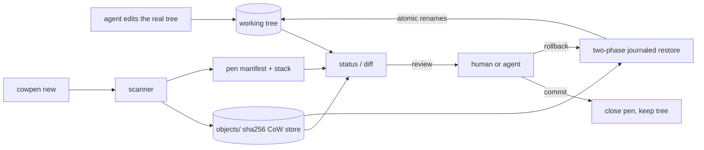

# cowpen

[English](README.md) | [中文](README.zh.md) | [日本語](README.ja.md)

[](LICENSE) [](go.mod) [](CHANGELOG.md)  [](CONTRIBUTING.md)

**cowpen：为 Agent 编辑准备的一次性写时复制（copy-on-write）工作区——一条命令快照整棵目录树，放手让 Agent 干活，之后 diff、commit 或原子回滚。**


```bash
git clone https://github.com/JaydenCJ/cowpen && cd cowpen
go build -o cowpen ./cmd/cowpen    # single static binary, stdlib only
```

> 预发布：v0.1.0 尚未发布到任何包注册表；请按上述方式从源码构建（任意 Go ≥1.22）。

## 为什么选 cowpen？

编码 Agent 会毁掉工作目录：迁移做一半、到处留垃圾文件、删错东西——而现有的安全网都建立在 cowpen 不需要的前提上。Git 假设目录*就是*一个仓库且干净到可以 stash：`git stash`/`worktree` 无法完整保住未跟踪的垃圾文件，会用 WIP 提交污染真实历史，在仓库之外更是无能为力。容器和 overlayfs 提供真正的 CoW，但需要 root、Linux 专属的挂载，还得把 Agent 的整套工具链搬进去。文件系统快照（btrfs、ZFS、APFS）很棒——前提是你几年前选文件系统时就想到了这一天。cowpen 是纯用户态的答案：`cowpen new` 把任意目录快照进一个内容寻址存储（相同内容只存一份——这就是写时复制），Agent 用它平常的工具就地编辑*真实*目录树，之后你会得到一份可审阅的统一 diff，以及一条命令即可完成的、带日志的原子回滚——文件、权限位、mtime、符号链接、被删除的整棵子目录全部精确复原。它明确*不是*系统调用沙箱：cowpen 的思路是让破坏变得便宜、可查、可撤销，而不是阻止写入。

| | cowpen | git stash / worktree | 容器 / overlayfs | 文件系统快照 (btrfs/ZFS) |
|---|---|---|---|---|
| 任意目录可用，无需仓库 | ✅ | ❌ 仅限仓库 | ✅ | ❌ 仅限该文件系统 |
| 无需 root、挂载或守护进程 | ✅ | ✅ | ❌ | 部分 |
| Agent 用平常的工具操作真实目录树 | ✅ | ✅ | ❌ 困在箱子里 | ✅ |
| 逐文件可审阅的统一 diff | ✅ | 部分，仅跟踪文件 | ❌ 层不透明 | ❌ |
| 一条命令原子回滚（含未跟踪垃圾） | ✅ 带日志 | ❌ 留下未跟踪文件 | ✅ 丢弃层 | ✅ |
| 保持 VCS 历史干净（无 WIP 提交） | ✅ | ❌ | ✅ | ✅ |
| 运行时依赖 | 0 | git | 运行时 + root | 文件系统 + 工具 |

<sub>依赖数核对于 2026-07-13：cowpen 只导入 Go 标准库；基于容器的隔离需要容器运行时，且在 Agent 宿主机上通常需要 root 或 userns 配置。</sub>

## 特性

- **一条命令建检查点** — `cowpen new` 快照目录树后即让开路；Agent 继续用平常的工具就地编辑，无包装器、无 chroot、不动 PATH。
- **写时复制存储** — 文件内容只在 SHA-256 内容寻址存储中存一份；在未变化的树上叠加新 pen 不写入任何新字节，`gc` 回收已关闭的 pen。
- **可审阅的 diff** — 内置 Myers 差分器输出与 git 兼容的统一 hunk（`@@` 头正确、含 `\ No newline` 标记）；二进制、符号链接、权限翻转和类型变化只给一行提示。
- **原子、带日志的回滚** — 恢复内容先暂存在目标旁，任何变更前先写日志，再以幂等 rename 应用；恢复中途崩溃可用 `rollback --resume` 补完，绝不会半途而废。
- **可叠加的 pen** — 每个高风险步骤前都可打检查点；`commit` 接受顶层 pen 而外层 pen 仍然待命，`rollback --to <id>` 可展开任意深度。
- **快而诚实的变更检测** — git 式 size+mtime+mode 快速路径，仅在元数据不一致时才计算哈希，`--verify` 可全量重哈希；逐字节相同的重写绝不会被报告为变更。
- **零依赖、完全离线** — 仅 Go 标准库；无遥测、无网络调用，任何数据都不会离开工作区根目录。

## 快速上手

```bash
cowpen new -m "before agent session"   # snapshot, then let the agent work
```

真实捕获的输出：

```text
opened p-djx7opeby6vf-b42a — snapshot of 2 files (63 B stored, 0 deduped)
edit freely; `cowpen diff` to review, `cowpen rollback` to undo
```

Agent 修改了一个文件、留下垃圾、还删掉了 README 之后（`cowpen status`，真实输出——退出码 1 表示"存在变更"）：

```text
D README.md
A scratch.log
M src/main.go
3 changed vs p-djx7opeby6vf-b42a (1 added, 1 modified, 1 deleted)
```

只审阅源码目录，然后撤销一切（`cowpen diff src` + `cowpen rollback`，真实输出）：

```text
--- a/src/main.go
+++ b/src/main.go
@@ -1,5 +1,5 @@
 package main
 
 func main() {
-	println("hello")
+	println("hello, world")
 }

rolled back to p-djx7opeby6vf-b42a — 2 restored, 1 removed, 1 pen closed
```

要非交互地守护整条命令，可用自带的包装器：`bash examples/agent-guard.sh --auto <command>` 在退出码 0 时保留变更、失败时回滚；`examples/checkpoint-loop.sh` 演示逐步骤的叠加检查点。

## 命令与退出码

`cowpen [--root DIR] [--format json] <command>` — 工作区根目录默认为从当前目录向上最近的 `.cowpen` 目录。

| 命令 | 作用 |
|---|---|
| `new [-m NOTE]` | 打开一个 pen：把目录树快照进 `.cowpen/`，然后随意编辑 |
| `status [--verify]` | 列出自顶层 pen 以来的变更；`--verify` 全量重哈希 |
| `diff [PATH...]` | 变更的统一 diff，可按路径限定范围 |
| `commit [-m NOTE]` | 接受变更并关闭顶层 pen（外层 pen 继续待命） |
| `rollback [--to ID]` | 原子恢复快照；`--resume` 补完被打断的回滚 |
| `list` / `show ID` / `log` | 打开的 pen · 单个 pen 详情 · 只追加的审计历史 |
| `gc` | 删除不再被任何打开 pen 引用的存储块 |

退出码：**0** 正常/干净 · **1** 存在变更（`status`/`diff`） · **2** 用法错误 · **3** 运行时错误。`--format json` 让除 `diff` 和 `version` 外的所有命令输出机器可读格式，便于 Agent 集成。

## 忽略规则

工作区根目录的 `.cowpenignore` 使用严格的 gitignore 子集——`#` 注释、段内 `*`/`?`、跨段 `**`、结尾 `/` 表示目录、开头 `/` 表示锚定；否定语法会被大声拒绝而不是错误匹配。`.cowpen/` 和 `.git/` 永远被排除。被忽略的路径对快照、status、diff *以及*回滚都不可见——cowpen 绝不会删除被忽略的文件，即使它位于一个正在被移除的目录里。磁盘布局细节见 [docs/format.md](docs/format.md)。

## 验证

本仓库不附带 CI；以上所有断言都由本地运行验证：

```bash
go test ./...            # 89 deterministic tests, offline, < 5 s
bash scripts/smoke.sh    # end-to-end CLI check, prints SMOKE OK
```

## 架构



## 路线图

- [x] v0.1.0 — 内容寻址 CoW 快照、带 `--verify` 的 git 式变更检测、内置 Myers 统一 diff、带 `--resume` 的两阶段日志式原子回滚、可叠加 pen、`.cowpenignore`、JSON 输出、审计日志、gc、89 个测试 + smoke 脚本
- [ ] `cowpen watch` — 长 Agent 会话中按文件变更防抖自动打检查点
- [ ] 部分回滚：`rollback -- <path>` 只恢复选定文件、保留其余
- [ ] 旧 pen 的打包格式：把已关闭 pen 的清单和数据块压缩为单个归档
- [ ] `cowpen export` — 把某个 pen 的变更导出为可 `git apply` 的补丁
- [ ] 针对哈希耗时占主导的超大目录树的可选硬链接模式

完整列表见 [open issues](https://github.com/JaydenCJ/cowpen/issues)。

## 贡献

欢迎 issue、讨论与 PR——本地工作流（格式化、vet、测试、`SMOKE OK`）见 [CONTRIBUTING.md](CONTRIBUTING.md)。入门任务带有 [good first issue](https://github.com/JaydenCJ/cowpen/issues?q=is%3Aissue+is%3Aopen+label%3A%22good+first+issue%22) 标签，设计讨论在 [Discussions](https://github.com/JaydenCJ/cowpen/discussions)。

## 许可证

[MIT](LICENSE)
